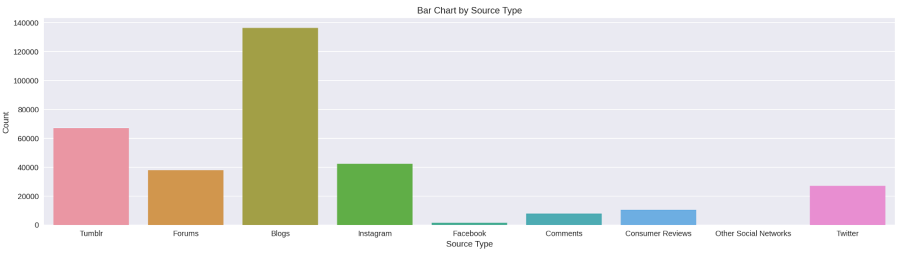

# Social-Media-Posts-Analysis
Social Media Posts Analysis on Samsung Galaxy and iPhone

## Business Problems

To find out customers' opinions and feedbacks on iPhone and Samsung cellphones through social media listening, we analyze posts on various social media platforms to answer questions such as:

● How do the customers feel generally towards the products?

● What attributes drive customers' interest in purchasing the product?

● Could we predict whether a person adopts/uptakes the product based on the post?

## Data
Social Media Posts in 2017 collected from Instagram, Tumblr, Facebook, Twitter, blogs, forums and customer reviews.
After data cleaning process, 330447 rows of data are kept for remaining analysis.

Number of Posts from Different Data Sources:

## Results
[paper](https://github.com/beckymark958/Social-Media-Posts-Analysis/blob/main/DSPM%20-%20Final%20Report.pdf)
